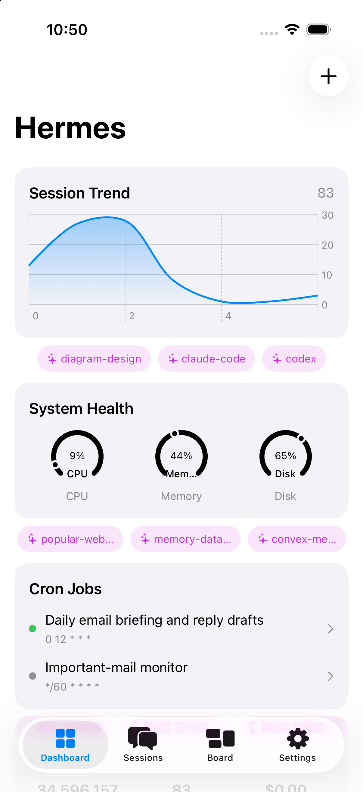
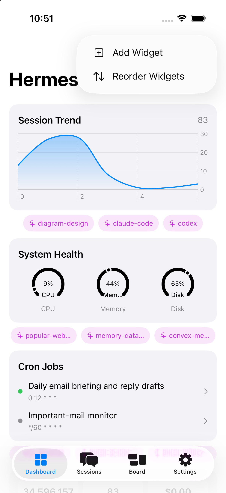
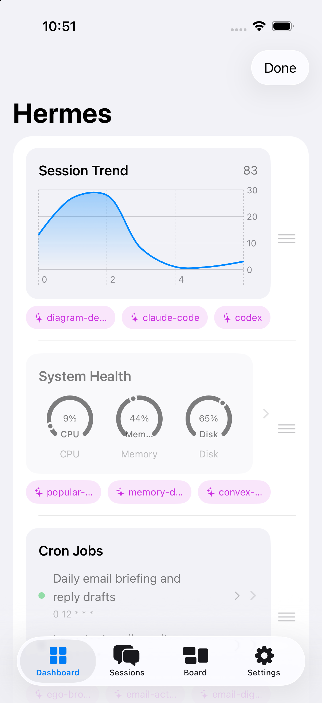

# Hermes Dashboard

A **dashboard-first iOS cockpit** for [hermes-webui](https://github.com/nesquena/hermes-webui) — your self-hosted AI agent. Built on top of [Hermex](https://github.com/uzairansaruzi/hermex), this fork adds a configurable widget dashboard that surfaces information proactively so you can monitor and act without opening a chat.

  
  
  

## What's New

### Configurable Widget Grid

The dashboard is your home screen. Each widget pulls live data from your hermes-webui server:

- **System Health** — CPU, memory, disk gauges at a glance
- **Session Trend** — sparkline chart of recent agent sessions
- **Cron Jobs** — status of scheduled tasks with drill-down
- **Insights** — token spend, session counts, activity by day
- **Alerts** — pending approvals and failed jobs
- **Kanban / Sessions** — task and session summaries

Widgets are fully configurable — choose from 9 visualization types (gauge, sparkline, area chart, bar chart, stat card, multi-stat, list, heatmap, timeline) and 6 data sources. Reorder with drag handles, edit with long-press, add new ones from the `+` menu.

### Tiered Action System

Every widget has context-aware action buttons:

| Tier | What it does | Cost |
|---|---|---|
| **Runbook** | Executes a cron job or slash command | Free |
| **AI** | Starts a scoped agent session | Tokens |
| **Hybrid** | Tries runbook first, escalates to AI on failure | Varies |

Actions are **user-configurable** — pin your favorites on each widget, and remaining slots auto-fill from recommendations.

### Decoupled Architecture

The dashboard is designed to survive upstream Hermex releases:

- **`DashboardDataProvider` protocol** — decouples from the concrete `APIClient`
- **`ServerCapabilityProbe`** — detects what your server supports via `GET /api/settings`
- **`WidgetRenderer` plugin system** — adding a new widget type is one file + one registration line
- **Domain model mapping** — dashboard models are independent of upstream API shapes

## Requirements

- iOS 18+
- A running [hermes-webui](https://github.com/nesquena/hermes-webui) instance
- Xcode 16+

## Getting Started

1. Clone the repo
2. Open `HermesMobile.xcodeproj` in Xcode
3. Build and run on a simulator or device
4. Connect to your hermes-webui server URL

All existing Hermex features (Sessions, Kanban, Settings) are preserved — the Dashboard is additive.

## License

MIT License — see [LICENSE](LICENSE) for details.

Based on [Hermex](https://github.com/uzairansaruzi/hermex) by Uzair Ansar.
